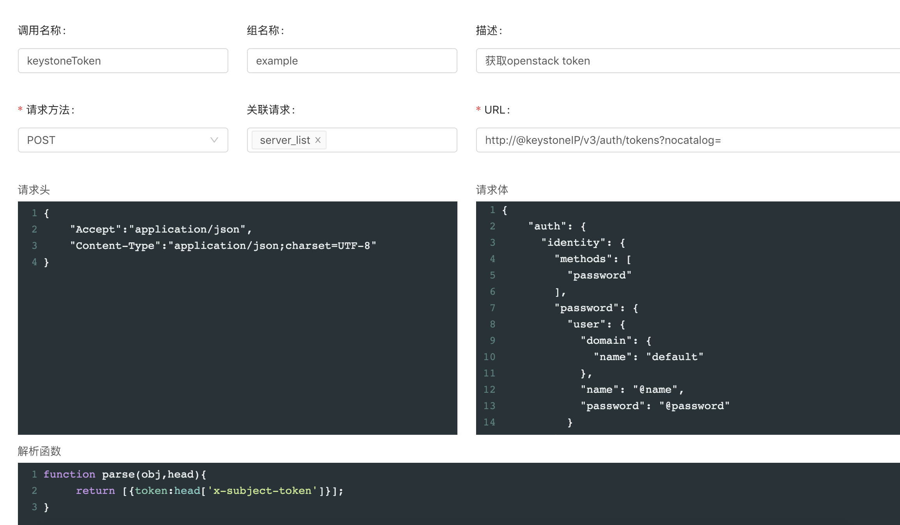

# node-restful-center
配置调用接口服务
-----
本代码用于将多个接口按照使用者的需要进行封装,并发布为一个统一的接口

# useage
代码需要node和MySQL环境,只适用于返回JSON格式的restful接口  
首先在 /node-restful-center/server/config/config.default.js 中配置mysql的链接信息  
在 /node-restful-center/server 目录下,执行 `npm i` 安装所需依赖  
相同目录下执行 `npm start`启动程序  
通过 http://127.0.0.1:7777/index 访问程序配置页面  

# example
下面通过一个列子说明程序的使用方法  
请先导入 /node-restful-center/example.sql中的内容导入数据库,在页面上可以看到导入的内容  
假设如下的使用场景:  
在openstack环境下,需要获取某个特定用户的云机物理资源使用率,如CPU,内存的使用率,要获取这些信息,需要关联调用多个接口,并对各个接口返回的信息进行计算或格式处理,本程序的主要作用就是通过在配置页面进行配置,完成接口调用    
首先,需要根据用户名和密码获取openstack的token,需调用如下接口:  
url: `http://@keystoneIP/v3/auth/tokens?nocatalog=`  
head:  
```
{
    "Accept":"application/json",
    "Content-Type":"application/json;charset=UTF-8"
}
```
body:
```
{
    "auth": {
      "identity": {
        "methods": [
          "password"
        ],
        "password": {
          "user": {
            "domain": {
              "name": "default"
            },
            "name": "@name",
            "password": "@password"
          }
        }
      }
      
    }
  }
```  


