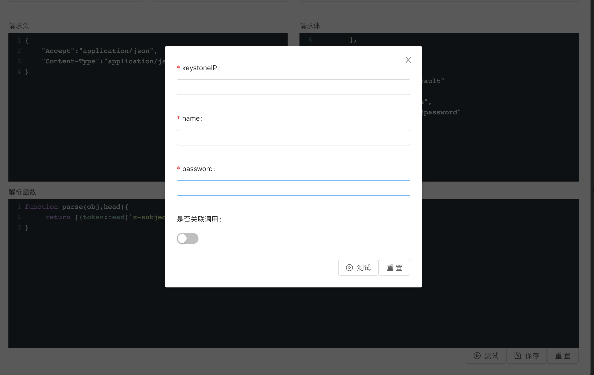

# node-restful-center
配置调用接口服务
-----
本代码用于将通过页面配置将多个接口按照使用者的需要进行封装,并发布为一个统一的接口

# useage
代码需要node和MySQL环境,只适用于返回JSON格式的restful接口  
首先在 /node-restful-center/server/config/config.default.js 中配置mysql的链接信息  
在 /node-restful-center/server 目录下,执行 `npm i` 安装所需依赖  
相同目录下执行 `npm start`启动程序  
通过 http://127.0.0.1:7777/index 访问程序配置页面  

# example
下面通过一个列子说明程序的使用方法  
请先导入 /node-restful-center/example.sql中的内容导入数据库,在页面上可以看到导入的内容  
假设如下的使用场景:  
在openstack环境下,需要获取某个特定用户的云机物理资源使用率,如CPU,内存的使用率,要获取这些信息,需要关联调用多个接口,并对各个接口返回的信息进行计算或格式处理,本程序的主要作用就是通过在配置页面进行配置,完成接口调用    
首先,需要根据用户名和密码获取openstack的token,需调用如下接口:  
url: `http://@keystoneIP/v3/auth/tokens?nocatalog=`  
head:  
```
{
    "Accept":"application/json",
    "Content-Type":"application/json;charset=UTF-8"
}
```
body:
```
{
    "auth": {
      "identity": {
        "methods": [
          "password"
        ],
        "password": {
          "user": {
            "domain": {
              "name": "default"
            },
            "name": "@name",
            "password": "@password"
          }
        }
      }

    }
  }
```  
在页面上点击***keystoneToken***一列的"修改"按钮可进入如下配置页面,图1


配置参数中的**@**为占位符,在调用时需要用具体的参数替换,点击上图页面的"测试"按钮,将出现如下页面:图2  

这里出现的是用**@**占位符标记的参数,在/node-restful-center/server/app/controller/mock.js中,mock了一份调用接口所需的数据,所以这里的keystoneIP就是本地服务的地址127.0.0.1:7777,同时由于mock的关系,name和password可以随便填,在不选中"是否关联调用"的情况下,点击上图页面的"测试",将调用该接口并出现如下页面:图3

这个页面除了展示模拟(请求由后台程序调用,并不是页面请求的)请求返回的结果,主要是用来测试解析函数的,下面就介绍解析下解析函数的用法,  
解析函数接收如下参数:responsebody,responsehead,responsestatus,requesthead,requestdata,url,这几个参数按照字面意思比较好理解,整个解析函数的目的就是让使用者按照自己的业务需求,将上面几个参数中的信息重新组合,转换得到更易读或其他调用程序更好理解的JSON格式,解析函数支持ES6语法,图3的解析函数很简单,就是获取响应头中'x-subject-token'中的token,并按照`[{token:'XXXX'}]`的格式返回,需要特别说明的是,在页面模拟调用的环境中,页面只能得到responsebody这一个参数,其他的参数只有在后台程序调用中才能得到,所以如果现在点击图3的"测试解析函数"按钮,将会得到一个head undefined的异常;
回到图1的页面,将"关联请求"一项中的***server_list***勾选去掉,并在图二的页面选中"是否关联调用",点击测试,将得到如下页面:图4  

可以看到返回结果变成了解析函数处理后的形式,图二中的"是否关联调用"如果选中,那么程序将在后台调用解析函数(如上面的介绍,后台程序才能得到responsehead),同时,如果图1页面中"关联请求"一项中的***server_list***在勾选状态的话,在获取到token后,程序会继续调用***server_list***接口,该接口的配置信息如下:图5  

***server_list***用来查询toekn对应用户的云机列表,在图5的配置中,需要两个参数(使用@占位):ComputeIP,token,这里的token已经在上一步的调用中得到,但ComputeIP还未知,所以这时关联调用***server_list***接口的话,程序会报错,当然也可以直接吧ComputeIP写死在***server_list***的配置中,这样就可以直接经行关联调用了;
现在单独调用***server_list***接口,在图5页面点击"测试"按钮,在弹出的对话框中填写token和ComputeIP(mock环境下仍然是127.0.0.1:7777),获得如下响应:
```
{
  "servers": [
    {
      "id": "3de00475-6e30-4c95-a36e-46fcd4f2bef2",
      "links": [
        {
          "href": "http://10.10.10.1:8774/v2.1/servers/3de00475-6e30-4c95-a36e-46fcd4f2bef2",
          "rel": "self"
        },
        {
          "href": "http://10.10.10.1:8774/servers/3de00475-6e30-4c95-a36e-46fcd4f2bef2",
          "rel": "bookmark"
        }
      ],
      "name": "S01003"
    },
    {
      "id": "3485a039-8fdf-4693-a4fb-2d9779fe8b1b",
      "links": [
        {
          "href": "http://10.10.10.1:8774/v2.1/servers/3485a039-8fdf-4693-a4fb-2d9779fe8b1b",
          "rel": "self"
        },
        {
          "href": "http://10.10.10.1:8774/servers/3485a039-8fdf-4693-a4fb-2d9779fe8b1b",
          "rel": "bookmark"
        }
      ],
      "name": "S01002"
    },
    {
      "id": "a96023e1-ab54-4137-98a0-47f6abb51fc7",
      "links": [
        {
          "href": "http://10.10.10.1:8774/v2.1/servers/a96023e1-ab54-4137-98a0-47f6abb51fc7",
          "rel": "self"
        },
        {
          "href": "http://10.10.10.1:8774/servers/a96023e1-ab54-4137-98a0-47f6abb51fc7",
          "rel": "bookmark"
        }
      ],
      "name": "S01001"
    }
  ]
}
```
上面的JOSN信息中,只有id,name是有用的,所以通过解析函数
```
function parse(obj){
   return obj.servers.map(o=>({instanceId:o.id,instanceName:o.name}))
}
```
进行解析(因为这里只需要responsebody,可以直接使用在图3页面的"测试解析函数"按钮进行测试),得到如下JSON:
```
[
    {
        "instanceId":"3de00475-6e30-4c95-a36e-46fcd4f2bef2",
        "instanceName":"S01003"
    },
    {
        "instanceId":"3485a039-8fdf-4693-a4fb-2d9779fe8b1b",
        "instanceName":"S01002"
    },
    {
        "instanceId":"a96023e1-ab54-4137-98a0-47f6abb51fc7",
        "instanceName":"S01001"
    }
]
```
从返回的结果可以看到,当前用户下有3台云机,下一步就可以根据得到的云机ID(instanceId)去调用下一个接口***monitor_info***(获取虚拟机信息指标),通过***monitor_info***的配置页面可以看到调用该接口需要3个参数:MetricIP,token,instanceId,这里MetricIP一样为"127.0.0.1:7777".  
需要特别说明的是,只有当上一级的接口返回为JSON数组时,才会关联调用下一级接口,比如获取token的接口返回的是`[{token:'XXXX'}]`,如果返回的是`[{token:'x1'},{token:'x2'}]`,那么程序就分别传递token x1,x2调用***server_list***接口两次,在这里,就意味着程序会传递不同的instanceId调用***monitor_info***接口3次.
***monitor_info***接口返回类似JSON(省略了某些内容):
```
{
  "id": "3de00475-6e30-4c95-a36e-46fcd4f2bef2",
  "metrics": {
    "vcpus": "ad8826fe-f9fc-41a8-b467-76a501e52dda",
    "disk.usage": "d5a3a1cc-eca2-4ce6-9e67-82b07015748f",
    "disk.read.bytes.rate": "e8653299-11e5-43dd-8026-0f1c1187c3ed",
    "cpu_util": "b1654fe9-cf04-41b0-b88d-c3d80e3cf97c",
    "memory.bandwidth.total": "a2a21486-9f90-4b10-ae6b-af823fb872d0",
    "memory": "024b219a-c3b7-4e0e-9fee-4f25c96c16d2",
    "memory.usage": "96168834-7d2b-47ab-b214-cf066f504d96",
    "memory.swap.in": "f8f952d3-390f-42a8-96fd-8a46e781e859",
    "cpu.delta": "136deba3-19d7-43de-ab5a-d8aed5afaf9f",
    "perf.instructions": "21582649-b03f-4308-a908-0beac4e5f1a5",
    "memory.bandwidth.local": "1e7c54bb-b715-47b9-a0dc-943f2cd2c378",
    "cpu": "8e226282-68e6-47bf-a7f5-32d4fecdbf6b"
  },
  "started_at": "2018-12-14T01:32:55.327278+00:00",
  "host": "yndkchs008.yndkch.com",
  "flavor_name": "4C16G100G",
}
```
结果中的`"vcpus": "ad8826fe-f9fc-41a8-b467-76a501e52dda"`,就是下一个接口***monitor_detail***所需的参数propertyId,同样使用对应的解析函数处理过上面的JSON后,处理后的结果作为参数用来调用***monitor_detail***接口.  
这时对于接口调用相关的配置就完成了,其实也就是配置每个接口的url,head,body和解析函数,用@站位符替代调用时传入的参数,用解析函数将调用返回的信息转化为自己需要的格式,同时配置关联调用的接口,这样在当前调用结束后,将当前调用获得的信息作为关联调用所需的参数再去调用关联的接口,在上面的列子中就是这样的调用顺序:***keystoneToken***->***server_list***->***monitor_info***->***monitor_detail***  
接下来需要配置一个"可调用接口"(这里已经配置好一个 ***monitor_api*** ),"可调用接口"是由程序发布出来的一个POST接口,可以通过http://{本机IP}:7777/invoke/{可调用接口名称}来访问,在这里就是http://127.0.0.1:7777/invoke/monitor_api  
在调用***monitor_api***时,就可以在请求体中传入其关联接口所需的参数,对于当前的列子,就是
```
{
	"name":"S01admin",
	"password":"S01adminyndkch",
	"keystoneIP":"127.0.0.1:7777",
	"MetricIP":"127.0.0.1:7777",
	"ComputeIP":"127.0.0.1:7777"
}
```
可以看到***monitor_api***的关联接口是***keystoneToken***,也就是说当调用***monitor_api***时,程序会去调用***keystoneToken***,调用***keystoneToken***完成后,又会去调用***keystoneToken***的关联接口,当所有的接口都完成调用时,所有结果组成一个大的JSON,作为***monitor_api***的结果返回,返回示列如下(有所省略):  
```
[
    {
        "keystoneToken-1": [
            {
                "token": "gAAAAABcAK5VysnGjEFgmhoGtMkv2j9gBXxvQ8KdZQ4MXbXJn_wI8ue85EUDglJOxxTkQiu5Aaosed6BSGUrVl9jWEGVnZF6IizKfFCm4swNmtgcbRjFwO-upeiqI3mMRXt9Fhr7ywYH9r3HP6o-GwpBaygCs1deS6VtgOwqFpteuVNQQFmeDIg"
            }
        ],
        "server_list-1-2": [
            {
                "instanceId": "3de00475-6e30-4c95-a36e-46fcd4f2bef2",
                "instanceName": "S01003"
            },
            {
                "instanceId": "3485a039-8fdf-4693-a4fb-2d9779fe8b1b",
                "instanceName": "S01002"
            },
            {
                "instanceId": "a96023e1-ab54-4137-98a0-47f6abb51fc7",
                "instanceName": "S01001"
            }
        ],
        "monitor_info-1-2-4": [
           {
               "propertyName": "vcpus",
               "propertyId": "94a5aee5-0a6b-46d2-b2b4-c849b06c1e07",
               "instanceName": "S01002"
           },
           {
               "propertyName": "cpu_util",
               "propertyId": "805324b3-d36f-4ead-b6db-9ebc9e0f8f19",
               "instanceName": "S01002"
           }
       ],
        "monitor_detail-1-2-3-4": {
            "instanceName": "S01003",
            "propertyName": "vcpus",
            "value": "4.00"
        },
        "monitor_detail-1-2-3-5": {
            "instanceName": "S01003",
            "propertyName": "cpu_util",
            "value": "0.59"
        }
    }
]
```  
返回的内容按照接口名称+后缀数字来展示,在这里后缀的数字只是为了保证名称的唯一,并没有实际意义,前面说过,由于***server_list***返回3组数据,所以***monitor_info***会被调用3次,其关联的***monitor_detail***又会根据不同的**propertyId**再被调用多次,所以这里返回的结果是一个很大的JSON,虽然很大,但已经包含了业务所需的所有信息,接下来只要为***monitor_api***配置解析函数,将上面的JSON转换为想要的结果就可以了.  
到此,整个接口的封装就完成了,以后只要直接调用***monitor_api***就可以得到所需的云机状态信息了,如果有实际的openstack环境,那么只要把***monitor_api***请求体中参数(keystoneIP,MetricIP)等换成实际的值,就可以得到实际环境下的结果了.
